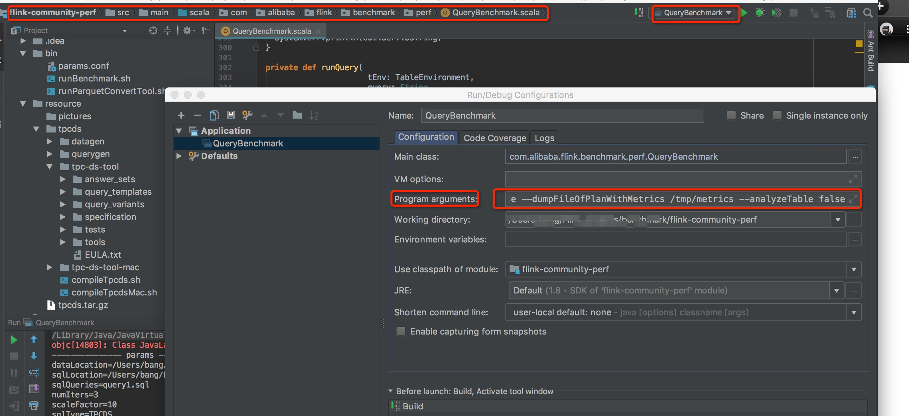

## flink-community-perf: 
Flink benchmark tools of tpc-h/tpc-ds performance tests,depending on the lastest flink-1.9. And we added few patches for
[Flink TPC-DS competition](https://tianchi.aliyun.com/competition/entrance/231742/introduction?spm=5176.12281949.1003.9.55e44c2aUc3y76),
the flink branch using in the competition is [flink/tpc-ds-master](https://github.com/flink-tpc-ds/flink-tpcds) which was forked
from [apache/flink](https://github.com/apache/flink).
   
    
## Project organization
In author's machine environment, the flink project and flink-community-perf project were organized as following:
```
    +--/home
       +--/hadoop
         +--/flink
            +--/flink-dist
            +--/flink-core
            +--...
         +--/flink-community-perf  
            +--/src
            +--/bin
            +--/resource      
```
And flink-community-perf project's directory organization is as following:

```
   +--/src
      +--/main
         +--/java
         +--/scala      
   +--/bin
      +--/params.conf
      +--/runBenchMark.sh
      +--/runParquetCnnvertTool.sh
   +--/resource
      +--/tpcds
         +--/compileTpcds.sh
         +--/compileTpcdsMac.sh
         +--/datagen
         +--/querygen
         +--/tpc-ds-tool  
         +--/tpc-ds-tool-mac             
```
         

## How to use 

### 1.Generate tpc-ds data and queries
(1) Compile the latest tpc-ds tools(v2.11.0), commands:
```
cd flink-community-perf/resource/tpcds
sh compileTpcds.sh
```
tpc-ds tools is not very friendly to mac developer,wo import tpc-ds tools for MACOS from github[tpcds-kit](https://github.com/databricks/tpcds-kit.git) to help you,commands:
```
cd flink-community-perf/resource/tpcds
sh compileTpcdsMac.sh
```
By the way,the version of tpc-ds tools in tpcds-kit is v2.4.

(2) Generate queries with  scaleFactor and random seed,commands:
```
cd flink-community-perf/resource/tpcds/querygen
sh generateTpcdsQueries.sh 10 0  
```

(3) generate data with same scaleFactor and random seed in generateing queries,commands:
```
cd flink-community-perf/resource/tpcds/datagen
sh generateTpcdsData.sh 10 0  
```

### 2.Optimize Flink code And build
(1) clone flink code from flink mirror[tpcds-master](https://github.com/flink-tpc-ds/flink),commands:
```
        cd /home/hadoop/flink
        git remote add flink-tpc-ds git@github.com:flink-tpc-ds/flink.git
        git fetch flink-tpc-ds
        git checkout tpc-ds
```

(2) Optimize flink code
The most import work is to Optimize flink code and configuration, You can do
    1) SQL optimization: optimize more the reasonable SQL execution plan;
    2) Operator optimization: optimize the more efficient SQL execution operator;
    3) Engine optimization: optimize in task scheduling,data transforming, etc.

(3)Build binary files,build commands:

```
    cd /home/hadoop/flink
    mvn clean install -DskipTests=true -Dfast 
    # optional, compiling parallel to speed up
    mvn clean install -DskipTests=true -Dfast -T 2C -Dmaven.compile.fork=true 
    
```

### 3.Do the tpc-ds tests with youe Flink code
You can run tpc-ds tests in your IDE like Intellij,and you can run tpc-ds tests in cluster too.

####  3.1 Run in Intellij:
(1) Find the mainClass: 
```
src/main/scala/com.alibaba/flink/benchmark/QueryBenchmark
```
(2) Modify the dependencies scope in pom.xml for run local.
```
<dependency.scope>compile</dependency.scope>
```

(3) Set run Configurations for mainClass:

Run single sql query(eg query1.sql) application,and set data scale is 10G, loop times is 3 ,program arguments are:
```
--sqlQueries query1.sql
--numIters 3
--scaleFactor 10 
--dataLocation /home/hadoop/flink-community-perf/resource/tpcds/datagen/data/SF10
--sqlLocation  /home/hadoop/flink-community-perf/resource/tpcds/querygen/queries/SF10  
--sqlType tpcds 
--sourceType csv
--optimizedPlanCollect true 
--dumpFileOfOptimizedPlan /tmp/plan/tpcds
--operatorMetricCollect false
--dumpFileOfPlanWithMetrics /tmp/metrics
--analyzeTable true
```
Set these arguments in Intellij:


And then run your Application.

Run all sql query application,and set data scale is 100G, loop times is 1 ,program arguments are:
```
--sqlQueries all
--numIters 1
--scaleFactor 100 
--dataLocation /home/hadoop/flink-community-perf/resource/tpcds/datagen/data/SF100
--sqlLocation  /home/hadoop/flink-community-perf/resource/tpcds/querygen/queries/SF100  
--sqlType tpcds 
--sourceType csv
--optimizedPlanCollect true 
--dumpFileOfOptimizedPlan /tmp/plan/tpcds
--operatorMetricCollect false
--dumpFileOfPlanWithMetrics /tmp/metrics
--analyzeTable true
```
And then Run or Debug your Application.

You can organize these arguments according your requirements.

####  3.2 Run in cluster:

(1) Start your Flink cluster standalone,commands:
```
cd /home/hadoop/flink/flink-dist/target/flink-1.9-tpcds-master-bin/flink-1.9-tpcds-master/bin 
sh start-cluster.sh
```
Now,you can open the url [http:localhost:8081](http:localhost:8081) to manage your cluster.You can also
set jobManager settings according to your machines' hardware before start,such as jobManager slot number,jobManager memory.

(2)Set necessary params,commands:
```
cd  /home/hadoop/flink-community-perf/bin
vim param.conf
```
Set key params according your environment:
````
### flink binaries package directory
export FLINK_DIR=/home/hadoop/flink/flink-dist/target/flink-1.9-tpcds-master-bin

### file directory stores tpc raw data
export DATA_LOCATION=/home/hadoop/flink-community-perf/resource/tpcds/datagen/data/SF${SF}

### sql queries local directory
export SQL_LOCATION=/home/hadoop/flink-community-perf/resource/tpcds/querygen/queries/SF${SF}

### flink-perf jar local file
export JAR_FILE=/home/hadoop/flink-community-perf/target/flink-community-perf-1.0-SNAPSHOT-jar-with-dependencies.jar
````

(3)Build application jar
Modify the dependencies scope in pom.xml for run in cluster.
```
       <dependency.scope>provided</dependency.scope>
```
Build the jar 
```
 cd /home/hadoop/flink-community-perf/
 mvn assembly:assembly

```

(4)Submit tpc-ds tests Application
```
cd /home/hadoop/flink-community-perf/bin
```
Run single sql query(eg:query1.sql) application,and set data scale is 10G, loop times is 3 ,command is:
```
sh runBenchmark.sh query1.sql 3 SF=10 
```

Run all sql query application,and set data scale is 100G, loop times is 1 ,command is:
```
sh runBenchmark.sh all 1 SF=100 
```

You can organize these arguments according your requirements.


### 4.Submit your Flink  binary file to Tianchi Website
(1) Build tar.gz file, Note: please exclude opt/* files to decrease the file size, opt/* files will not be used in the competition
```  
    cd your/flink/flink-dist/target/flink-1.9-tpcds-master-bin 
     # ---:parquet Sink Source dependencies，copy here when using parquet---
        cp ~/.m2/repository/org/apache/parquet/parquet-column/1.8.2/parquet-column-1.8.2.jar ./lib/
        cp ~/.m2/repository/org/apache/parquet/parquet-hadoop/1.8.2/parquet-hadoop-1.8.2.jar ./lib/
        cp ~/.m2/repository/org/apache/parquet/parquet-common/1.8.2/parquet-common-1.8.2.jar ./lib/
        cp ~/.m2/repository/org/apache/parquet/parquet-encoding/1.8.2/parquet-encoding-1.8.2.jar ./lib/
        cp ~/.m2/repository/org/apache/parquet/parquet-format/2.3.1/parquet-format-2.3.1.jar ./lib/
        cp ~/.m2/repository/org/codehaus/jackson/jackson-core-asl/1.8.8/jackson-core-asl-1.8.8.jar ./lib/
        cp ~/.m2/repository/org/codehaus/jackson/jackson-mapper-asl/1.8.8/jackson-mapper-asl-1.8.8.jar ./lib/
        cp ~/.m2/repository/org/apache/flink/flink-shaded-hadoop-2-uber/2.4.1-7.0/flink-shaded-hadoop-2-uber-2.4.1-7.0.jar ./lib/
     # ---:parquet Sink Source dependencies，copy here when using parquet---
    tar --exclude=flink-1.9-tpcds-master/opt/ -zcvf flink-1.9-tpcds-master.tar.gz   flink-1.9-tpcds-master/  
    upload your flink-1.9-tpcds-master.tar.gz to Tanchi 
       
     # zip format：zip -v -r flink-1.9-tpcds-master.zip flink-1.9-tpcds-master/ -x  \*flink-1.9-tpcds-master/opt\*  

```

### 5.Data format convert
Parquet is an efficient data organization format in big data processing, the default data format produced by TPC-DS is csv format.So wo made a parquet conversion tool
to convert data from csv format to parquet.

####  5.1 Do conversion in Intellij:
(1) Find the mainClass: 
```
src/main/scala/com.alibaba/flink/benchmark/tools/CsvToParquet
```
(2) Modify the dependencies scope in pom.xml for run local.
```
<dependency.scope>compile</dependency.scope>
```

(3) Set run Configurations for mainClass:

Run conversion tool application,and set data scale is 1G, program arguments are:
```
--scaleFactor 1 
--sqlType tpcds 
--dataLocation  /home/hadoop/flink-community-perf/resource/tpcds/datagen/data/SF1
--compressionCodec snappy
```
Set these arguments in Intellij,and then run the mainClass.

You can organize these arguments according your requirements.

####  5.2 Run in cluster:

(1) Start your Flink cluster standalone,commands:
```
cd /home/hadoop/flink/flink-dist/target/flink-1.9-tpcds-master-bin/flink-1.9-tpcds-master/bin 
sh start-cluster.sh
```
(2)Set necessary params,commands:
```
cd  /home/hadoop/flink-community-perf/bin
vim param.conf
```
Set key params according your environment:
````

### flink parquet compression type,parquet format has better performance than csv format
export COMPRESSION_TYPE=snappy

### flink binaries package directory
export FLINK_DIR=/home/hadoop/flink/flink-dist/target/flink-1.9-tpcds-master-bin

### file directory stores tpc raw data
export DATA_LOCATION=/home/hadoop/flink-community-perf/resource/tpcds/datagen/data/SF${SF}

### flink-perf jar local file
export JAR_FILE=/home/hadoop/flink-community-perf/target/flink-community-perf-1.0-SNAPSHOT-jar-with-dependencies.jar
````

(3)Build application jar
Modify the dependencies scope in pom.xml for run in cluster:
```
       <dependency.scope>provided</dependency.scope>
```

Build the jar:
```
 cd /home/hadoop/flink-community-perf/
 mvn assembly:assembly

```

(4)Submit tpc-ds tests Application
```
cd /home/hadoop/flink-community-perf/bin
```
Run the Conversion application:
```
sh runParquetConvertTool.sh SF=10
```


## Contact us
If you have any question about the tool and [Flink TPC-DS Competition](https://tianchi.aliyun.com/competition/entrance/231742/introduction?spm=5176.12281949.1003.9.55e44c2aUc3y76),please contact us 
by dingTalk，our group number is:21950145


   